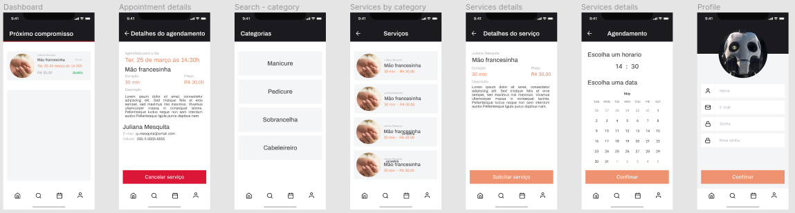

# Nebulosa-Customer

Este é o frontend mobile do projeto **Nebulosa**, especificamento para os clientes. Consistirá em funcionalidas para os clientes como agendar um novo serviço, buscar, visualizar perfil, etc.



## Executar aplicação

**Requisitos**

- [NodeJS](https://nodejs.org/en/) - 14.x
- NPM - 7.20.3
- [Expo CLI](https://docs.expo.dev/workflow/expo-cli/) - 4.10.0
- [Expo client](https://play.google.com/store/apps/details?id=host.exp.exponent&hl=pt_BR&gl=US)

Adicione o repositorio em sua maquina.

```bash

$ git clone https://github.com/DenisMedeirosSDK/Nebulosa-Mobile-Customer.git

$ cd Nebulosa-Mobile-Customer

```

Instale as dependencias: `npm run install`

Execute a aplicação: `expo start`

Baixe o Expo Client em seu smartphone

Leia o QRCode com o expo client
